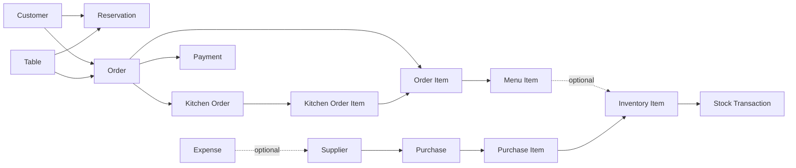

# Restaurant Management

A minimal, standalone Frappe application for running the core day-to-day operations of a restaurant: tables, reservations, menu, orders, kitchen tickets, payments, inventory, purchasing, staff, and expenses.

## Overview

Restaurant Management gives a small restaurant a single, simple system to record what it needs to run day to day, without pulling in the size and complexity of a full ERP. It is intentionally minimal: 17 DocTypes total, no ERPNext or HRMS dependency, and no automation — every document is created and updated directly by restaurant staff.

The core front-of-house workflow:

```
Restaurant Setup
    → Tables
    → Customers / Reservations
    → Menu
    → Orders
    → Kitchen Orders
    → Payments
```

A separate, independent inventory workflow:

```
Inventory Items
    → Purchases
    → Stock Transactions
```

**Staff** is a simple standalone employee directory (no shift, attendance, or performance tracking). **Expense** is a simple standalone operating-expense log, optionally tagged to a Supplier. Neither connects into the order/inventory flow.

## Features

- Table management with status and seating capacity
- Customer directory with a simple loyalty points balance
- Reservation and waitlist tracking (single DocType, distinguished by type)
- Menu item catalog with pricing and tax rate, optionally linked to an Inventory Item
- Order taking (dine-in or takeaway) with line items and running totals
- Kitchen order tickets (KOT) derived from order line items
- Payment recording against an order
- Inventory item master with unit of measure and reorder level
- Stock transaction log (purchase receipt, manual adjustment, or waste)
- Supplier directory
- Purchase transactions with line items and a status lifecycle
- Staff directory
- Expense logging

## DocType Architecture

The app deliberately uses a minimal 17-DocType architecture: 14 main DocTypes and 3 Child Tables. There are no separate master DocTypes for UOM, Item Group, Warehouse, or Tax — those are plain Select/Data/Percent fields instead, and there is no ERPNext dependency anywhere in the schema.

| DocType | Type | Purpose |
|---|---|---|
| Restaurant Settings | Main (Single) | Global restaurant configuration |
| Table | Main | Restaurant tables/seating |
| Customer | Main | Customer directory |
| Menu Item | Main | Sellable menu items |
| Reservation | Main | Table reservations and waitlist entries |
| Order | Main | Customer order / bill |
| Kitchen Order | Main | Kitchen ticket (KOT) |
| Inventory Item | Main | Raw material / stock item master |
| Stock Transaction | Main | Stock movement record |
| Supplier | Main | Vendor directory |
| Purchase | Main | Purchase transaction with a supplier |
| Staff | Main | Staff directory |
| Payment | Main | Payment received against an order |
| Expense | Main | Operating expense |
| Order Item | Child Table | Line items within an Order |
| Kitchen Order Item | Child Table | Line items within a Kitchen Order |
| Purchase Item | Child Table | Line items within a Purchase |

## DocType Details

### Restaurant Settings

A Single DocType holding global configuration for the restaurant. There is only ever one record.

Important fields:
- restaurant_name, address, phone, email
- gstin, fssai_license
- currency (Link to Frappe core Currency)
- opening_time, closing_time
- default_tax_rate, service_charge_percentage
- max_party_size, default_reservation_duration

It doesn't link out to any other restaurant_management DocType — it's read as reference configuration.

### Table

Represents a physical table in the restaurant.

Important fields:
- table_number, table_name
- capacity
- area
- table_type
- status
- is_active

Referenced by Reservation and Order.

### Customer

Stores restaurant customer information.

Important fields:
- customer_name
- phone
- email
- customer_type
- loyalty_points
- is_active

loyalty_points is a plain balance field on the customer record — there is no separate loyalty program/tier/transaction subsystem. Referenced by Reservation and Order.

### Menu Item

A sellable dish or drink.

Important fields:
- item_code, item_name
- category (free-text)
- price, tax_rate
- inventory_item — an optional Link to Inventory Item, purely a structural relationship (no automatic stock deduction is implemented)
- is_vegetarian, is_available
- image

Referenced by Order Item.

### Reservation

A table booking or waitlist entry — the same DocType handles both, distinguished by `reservation_type`.

Important fields:
- customer (Link), table (Link)
- reservation_type: Reservation or Waitlist
- reservation_date, reservation_time, party_size
- status
- special_requests, notes

### Order

The customer order — this also serves as the restaurant bill; there is no separate Invoice DocType.

Important fields:
- order_type: Dine In or Takeaway
- customer (Link), table (Link)
- order_date, order_time
- items — Child Table of Order Item
- subtotal, tax_amount, discount_amount, total_amount
- payment_status, status

Connects to Kitchen Order (which references the Order) and Payment (which references the Order).

### Kitchen Order

A kitchen ticket (KOT) generated for an order.

Important fields:
- order (Link, required)
- table (Link, fetched from the order)
- station — a fixed Select (Grill/Salad/Dessert/Bar/Main/General), not a separate DocType
- items — Child Table of Kitchen Order Item
- status, priority
- special_instructions

### Inventory Item

The raw-material/stock item master.

Important fields:
- item_code, item_name
- item_group (free-text, not a separate DocType)
- uom — fixed Select (Kg/Gram/Litre/Ml/Piece/Pack/Dozen/Box), not a separate DocType
- standard_rate
- reorder_level
- is_active

Referenced by Purchase Item, Stock Transaction, and optionally by Menu Item.

### Stock Transaction

A single stock movement record.

Important fields:
- item (Link, required)
- transaction_type: Purchase, Manual Adjustment, or Waste
- warehouse — a fixed Select (Main Store/Kitchen/Bar), not a separate DocType
- qty
- date
- reference, notes

There is no separate Warehouse DocType and no automatic stock-balance calculation — each Stock Transaction is an independent record entered directly.

### Supplier

The vendor/supplier directory.

Important fields:
- supplier_name
- contact_person, phone, email, address
- gstin
- is_active

Referenced by Purchase and optionally by Expense.

### Purchase

A complete purchase transaction with a supplier — this covers the whole lifecycle (there are no separate Purchase Order / Purchase Receipt / Purchase Invoice DocTypes).

Important fields:
- supplier (Link, required)
- purchase_date
- items — Child Table of Purchase Item
- total_amount
- status: Draft, Ordered, Received, or Paid
- notes

### Staff

A simple, standalone staff directory. There is no Attendance, Shift, Staff Skill, or Staff Performance DocType.

Important fields:
- employee_id, full_name
- role
- phone, email
- date_joined
- salary
- is_active, notes

### Payment

A payment recorded against an order.

Important fields:
- order (Link, required)
- payment_date
- payment_mode
- amount
- reference_number, notes

### Expense

A standalone operating-expense record.

Important fields:
- expense_date
- category
- amount, payment_mode
- description
- supplier — optional Link to Supplier
- notes

## Child Tables

### Order Item

Used inside Order.items. Stores one menu item line of the order.

Fields: menu_item (Link to Menu Item), item_name (fetched), qty, rate (fetched from the menu item's price), amount.

### Kitchen Order Item

Used inside Kitchen Order.items. Stores one line of the kitchen ticket, tied back to the originating order line rather than duplicating item data.

Fields: order_item (Link to Order Item), item_name (fetched from order_item), qty (fetched from order_item), special_instructions.

### Purchase Item

Used inside Purchase.items. Stores one inventory item line of the purchase.

Fields: item (Link to Inventory Item), item_name (fetched), qty, rate, amount.

## How The App Works

1. **Restaurant Setup** — configure the single Restaurant Settings record (name, hours, tax rate, etc.).
2. **Table Management** — create Table records with capacity and status.
3. **Customer Management** — create Customer records as guests are registered.
4. **Reservations** — book a table for a Customer via Reservation (or log a walk-in as a Waitlist-type Reservation).
5. **Menu Management** — build out the Menu Item catalog with prices and categories.
6. **Order Management** — create an Order for a Customer/Table, add Order Item lines from the Menu Item catalog.
7. **Kitchen Orders** — create a Kitchen Order against the Order, with Kitchen Order Item lines referencing the Order Item lines.
8. **Payments** — record a Payment against the Order once the bill is settled.
9. **Inventory** — maintain the Inventory Item master, log movements as Stock Transaction records (purchase receipt, manual adjustment, or waste).
10. **Purchasing** — record a Purchase against a Supplier with Purchase Item lines, tracked through Draft → Ordered → Received → Paid.
11. **Staff** — maintain the Staff directory.
12. **Expenses** — log operating expenses, optionally tagged to a Supplier.

## Relationships



## Installation

```bash
# Get the app (already present in this bench under apps/restaurant_management)
bench get-app restaurant_management <repo-or-path>

# Install it on a site
bench --site <site-name> install-app restaurant_management

# Apply schema changes
bench --site <site-name> migrate

# Clear cache if the Desk UI shows stale metadata
bench --site <site-name> clear-cache
```

## App Structure

- `restaurant_management/` — the app's Python package
  - `doctype/` — one folder per DocType, each containing `<name>.json` (schema), `<name>.py` (controller), and `__init__.py`
  - `hooks.py` — app metadata (name, title, publisher, license); no custom hooks are wired up
  - `config/`, `patches/`, `public/`, `templates/`, `www/` — standard Frappe app scaffolding, currently unused
- `README.md` — this file

## Design Principles

- Minimal DocType architecture — 17 DocTypes total
- No ERPNext dependency
- No HRMS dependency
- Child Tables used for all line items (Order Item, Kitchen Order Item, Purchase Item)
- No unnecessary master DocTypes — UOM, Item Group, Warehouse, and Tax are plain fields, not DocTypes
- Simple, direct relationships — no multi-hop procurement chains or duplicate billing documents
- Frappe core functionality reused where appropriate (e.g. the core Currency DocType on Restaurant Settings)

## Current Scope

This app covers direct, manual record-keeping for: restaurant setup, tables, customers, reservations/waitlist, menu, orders, kitchen tickets, payments, inventory items, stock transactions, suppliers, purchases, staff, and expenses.

All DocType controllers are empty (`pass`) — there is no business logic implemented. Specifically, the following are **not** implemented:

- Automatic inventory deduction when an order is placed or served
- Recipe-based stock consumption
- Advanced accounting (ledgers, tax templates, multi-currency conversion)
- Delivery management (Order only supports Dine In and Takeaway)
- Attendance management
- Shift management
- Loyalty program management (only a flat `loyalty_points` number exists on Customer)
- Automated tax calculations
- Automated stock-balance calculations (Stock Transaction records are independent entries; there is no running balance computed anywhere)

## Future Enhancements

The following are reasonable future possibilities only — none of them exist in the current app:

- Advanced inventory automation (running stock balances, low-stock alerts)
- Recipe-based stock consumption when a menu item is sold
- Attendance and shift management
- Advanced reporting and dashboards
- Delivery management
